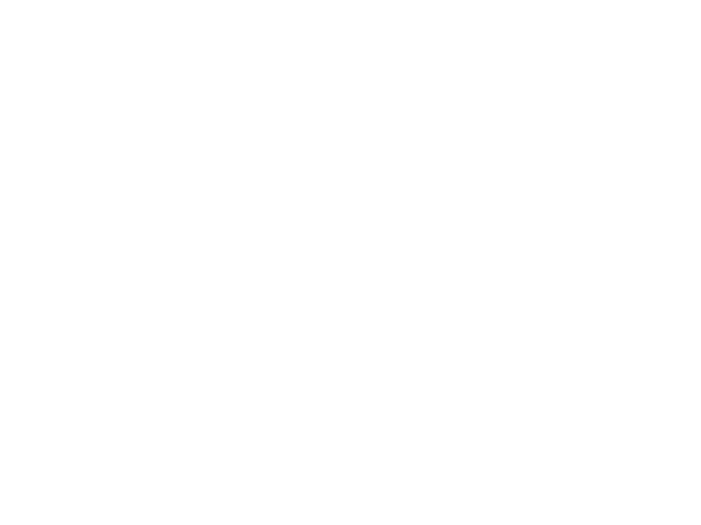

# Morsifier

A Kivy application to translate text to-, listen to- and download morsecode.

<div align="center">
    
</div>

## Description

Morsifier is an application that allows users to translate text to morse code. The outputted morse code can be read, listened to and seen in the form of a simulated flashlight. The audiofiles containing the morse code can be saved to the user's computer.

Morsifier currently only allows text-to-morse.

### Step-by-step

Start by choosing a tempo given in words-per-mimnute (wpm) by clicking one of the numbered buttons.
Type in the alphanumerical text you want to translate to morse into the input box
Press proceed
The morse translation will show up in the box below and the corresponding morse sound will play

- Press the sideways 8 button to continuously loop over the morse code
- Press the speaker icon to mute/unmute the sound
- Pressing the arrow pointing into a box icon will prompt a new window allowing you to save the morse sound file as a .wav to your computer
- Pressing the "toggle flashlight" button enables a box that simulates morse code with a flashlight

To translate another text press the reset button to enable the text input again.

## Getting Started

### Dependencies

- Python 3.10
- Kivy
- NumPy

#### Installing dependencies

##### Install Python 3.10.0

Download the Python installer from <a href="https://www.python.org/downloads/">Python's official website</a>, or install with <a href="https://brew.sh">Homebrew</a> by typing the following command in your terminal:
```
brew install python@3.10
```


### Executing program

After installing all of the dependencies, run `main.py` in your editor of choice or type the following command in your terminal:
```
python3 main.py
```
or
```
python3.10 main.py
```


## Authors

- @Hitijahujessy
- @MrWaltTG1

## Version History

1.0
Initial Release

## License

This project is licensed under the MIT License - see the LICENSE.md file for details
