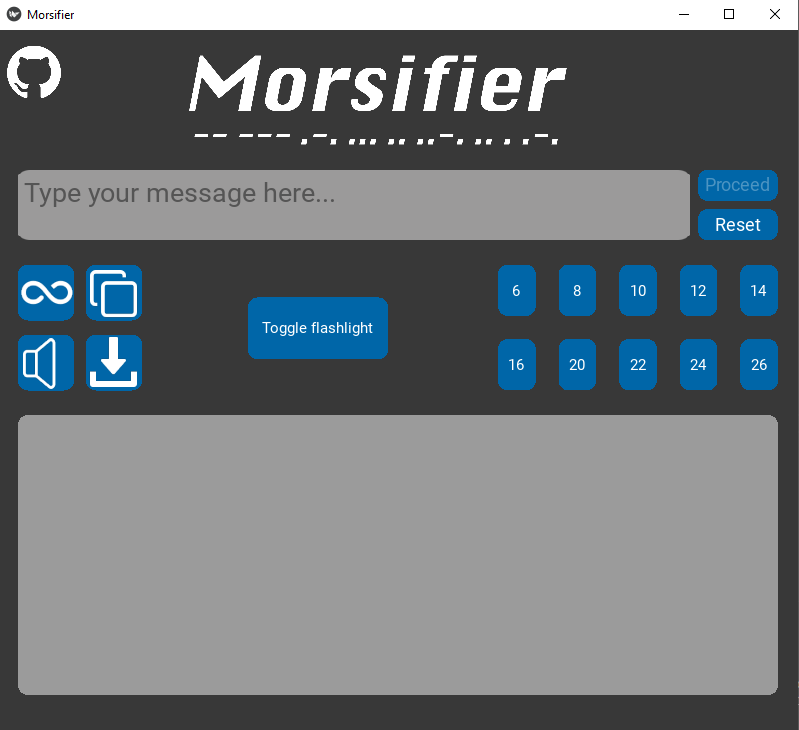

# Morsifier

A Kivy application to translate text to-, listen to- and download morsecode.

<div align="center">
    
</div>

## Description

Morsifier is an application that allows users to translate text to morse code. The outputted morse code can be read, listened to and seen in the form of a simulated flashlight. The audiofiles containing the morse code can be saved to the user's computer.

Morsifier currently only allows text-to-morse.


## Getting Started

### Dependencies

- Python 3.10
- Kivy
- NumPy
- Pydub

### Installing dependencies

#### Install Python 3.10.0

Download the Python installer from <a href="https://www.python.org/downloads/">Python's official website</a>, or install with <a href="https://brew.sh">Homebrew</a> by typing the following command in your terminal:
```
brew install python@3.10
```

#### Installing kivy 2.1.0

To install kivy follow the steps in their <a href="https://kivy.org/doc/stable/gettingstarted/installation.html">official guide</a>.

Make sure to install the full dependency "kivy[full]":
```
python -m pip install "kivy[full]"
```

#### Install Numpy and pydub

In your terminal type the following command (preferably inside your virtual environment):
```
pip install numpy

pip install pydub
```

## Usage

### Executing the program

After installing all of the dependencies, run `main.py` in your editor of choice or navigate to the top folder in your virtual env and type the following command in your terminal:
```
python3 main.py
```
or
```
python3.10 main.py
```

### Step-by-step
<div align="center"></div>
There are only a few steps required to use Morsifier in it's most basic way. Type a message in the textbox, press the  and the morse code will appear in the big gray box. The audio of the morse code will be played as well. When you're ready to write another message you can press the reset button.

When the button with the infinity symbol is pressed, the morse code audio will loop and the code in the big gray box will be highlighted per character. Next to the loop button, you'll find the copy-to-clipboard button. When pressing this button, the morse code will be copied to your clipboard.

If you don't want the morse code to be played as audio you can press the mute button, located under the loop button. The audio can also be saved to your computer. To do this, press the download button, which is located next to the mute button.

You may also want to see what the morse code looks like if the message would be relayed using a flashlight. This is possible by pressing the toggle flashlight button.

Next to the toggle flashlight button you'll find 10 numbered buttons. These numbers represent the words-per-minute (wpm). These buttons can be pressed to change the speed of the outputted morse code. When you download the morse code audio file, it will use the currently selected wpm.


## Authors

- <a href="https://github.com/Hitijahujessy">@Hitijahujessy</a>
- <a href="https://github.com/MrWaltTG1">@MrWaltTG1</a>

## Version History

1.0
Initial Release

## License

This project is licensed under the MIT License - see the LICENSE.md file for details
